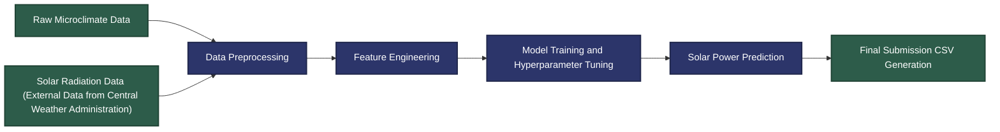

# AI-Cup-2020-Mango-Image-Classification
深度學習｜🥭 AI Cup 2020：愛文芒果影像辨識——等級分類(Mango image recognition for grade classification)

## ⚙️ Workflow Architecture


## 📂 Repository Structure
```text
AI-Cup-2020-Mango-Image-Classification/
├── competition-guidelines/       # 競賽官方說明文件
├── data/                         
│   ├── sample-images/            # 原始芒果影像樣本，包含 A, B, C 三個等級
│   │   ├── sample_A.jpg          
│   │   ├── sample_B.jpg          
│   │   └── sample_C.jpg          
│   └── processed/                # 經裁剪與去模糊處理之影像樣本
│       ├── sample_A_processed.jpg 
│       ├── sample_B_processed.jpg 
│       └── sample_C_processed.jpg 
├── scripts/
│   ├── crop.ipynb             # 影像裁剪程式碼
│   ├── deblur.ipynb           # 使用 SRN-Deblur 
│   └── mango_training.ipynb   # 主程式碼
├── reports/                      
│   └── report.pdf             # 專案技術報告
└── README.md
```
